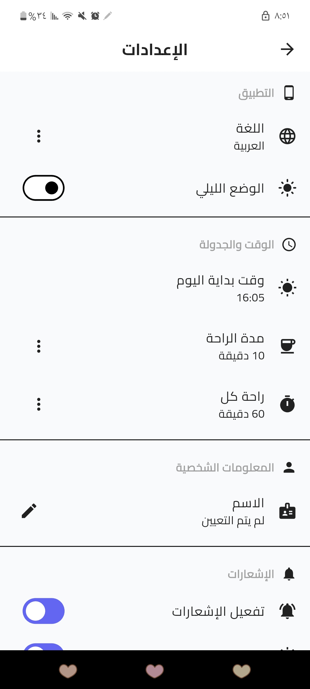

# الميزانية الذكية (Smart Budget)

تطبيق احترافي لإدارة الميزانية الشخصية وتتبع المصروفات والإيرادات اليومية والشهرية. تم تصميم التطبيق باستخدام إطار عمل **Flutter** لتوفير تجربة مستخدم سلسة وعصرية على الهواتف الذكية.

---

## 🌟 الميزات الرئيسية (Features)
- **إدارة الحسابات:** تتبع دقيق للمصروفات والدخل وتصنيفها بشكل مرئي.
- **إحصائيات ورسوم بيانية:** عرض التقارير المالية عبر رسوم بيانية تفاعلية باستخدام `fl_chart`.
- **قاعدة بيانات محلية:** تخزين آمن وسريع للبيانات محلياً باستخدام `hive`.
- **قراءة الفواتير (Invoices):** دعم التقاط صور الفواتير وحفظها باستخدام `image_picker`.
- **التقارير (Reports):** تصدير التقارير المالية على شكل PDF وطباعتها بسهولة.
- **الإشعارات:** تنبيهات مخصصة لمتابعة ميزانيتك أولاً بأول.
- **المشاركة:** مشاركة تقارير الميزانية والمصاريف بنقرة واحدة.

---

## 📸 لقطات من واجهة التطبيق (Screenshots)

إليك بعض واجهات تطبيق الميزانية الذكية (قم بحذف الصور التي لا تتعلق بالتطبيق إن وجدت):


<br>
<div align="center">
  
  
  
</div>
<br>
<div align="center">
  
  
  
</div>
<br>
<div align="center">
  
  
  
</div>

---

## 🛠️ التقنيات المستخدمة (Tech Stack)
- **Framework:** Flutter (Dart)
- **State Management:** Provider
- **Local Database:** Hive
- **Charts:** fl_chart
- **PDF Generation:** pdf, printing
- **Local Notifications:** flutter_local_notifications

---

## 🚀 كيفية تشغيل المشروع (How to Run)

1. **نسخ المستودع (Clone Repository):**
   ```bash
   git clone <repository_url>
   cd smart_budget
   ```

2. **تحميل الحزم (Install Packages):**
   ```bash
   flutter pub get
   ```

3. **تشغيل التطبيق (Run):**
   ```bash
   flutter run
   ```

---
**تم التطوير بواسطة: المهندسة ريم طاهر محمد الوعيل**
